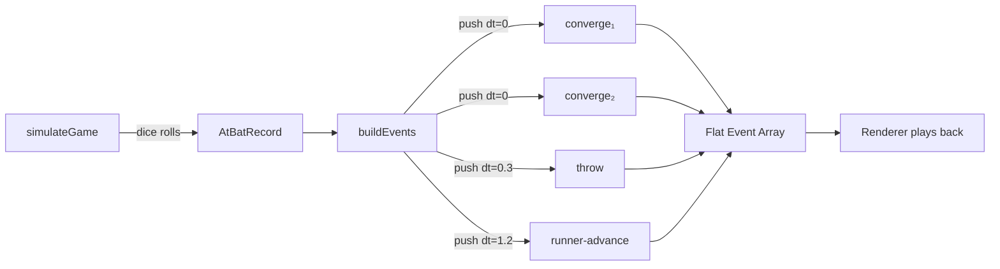
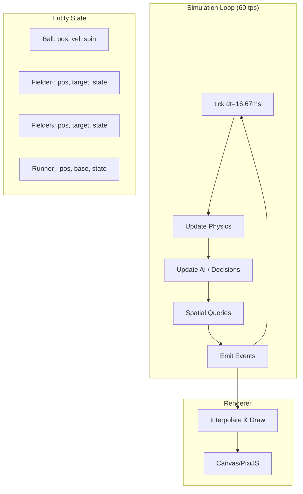

# Game Engine Redesign: Event Timeline → Tick-Based Simulation

## What You're Seeing (and Why). May 4th 2026

The current architecture has a fundamental design constraint that causes the "sequential, not concurrent" feel:

### Current Model: Pre-Computed Event Timeline



**How it works today:**
1. `simulateGame()` rolls all the dice — every pitch, hit, out, run — and produces `AtBatRecord[]` (pure data, no positions)
2. `buildEvents()` walks through each `AtBatRecord` and emits visual events using `push(event, dt)` which **advances a global clock**
3. The renderer receives a flat array of `{type, t, ...data}` events sorted by time, and tweens sprites accordingly

**The core problem:** `push(event, dt)` is a **sequential accumulator**. Each event's timestamp is `t += dt`. Events pushed at `dt=0` share the same `t`, but they're still processed in array order. There's no concept of "entity A is at position X while entity B is at position Y" — only "at time T, start tweening entity A toward point P."

This means:
- The fielder, ball, runners, and cutoff man all have **independent tweens** that happen to overlap in time but aren't spatially coordinated
- There's no moment where the engine says "the ball is at (120, 300) and the fielder is at (115, 295) — he's close enough to grab it"
- Every interaction (catch, throw, tag) is **pre-decided** by the dice roll, then the visuals are staged to match

### Why Patching Gets Harder

Every fix we make (two-phase converge, relay timing, cutoff delays) is essentially **manually choreographing** when things should happen. We're doing the game engine's job by hand:

| Problem | Manual Fix | Real Engine Solution |
|---|---|---|
| Ball arrives before cutoff | Calculate delay from travel times | Cutoff entity catches ball when it reaches him |
| Fielder always "on the ball" | Two-phase converge with chase role | Fielder runs toward predicted landing; ball physics + fielder physics run concurrently |
| Throw timing vs runner | Pre-compute throw flight + runner speed | Both entities tick forward; tag happens when they're at the same base |
| PBP ahead of visuals | Reorder event array | Events are emitted as they happen in sim-time |

---

## What a Tick-Based Engine Looks Like

### Architecture: Entity-Component-System (ECS-lite)



### Core Concepts

#### 1. Fixed-Timestep Loop
```typescript
const TICK_RATE = 60;  // ticks per second
const DT = 1 / TICK_RATE;

function simulate(game: GameState): SimResult {
  while (!game.isOver) {
    // Every entity moves simultaneously
    updateBallPhysics(game.ball, DT);
    for (const f of game.fielders) updateFielder(f, game, DT);
    for (const r of game.runners)  updateRunner(r, game, DT);
    
    // Check interactions AFTER all movement
    checkCatches(game);
    checkTags(game);
    checkBallLanded(game);
    
    // Emit events for anything that happened this tick
    emitTickEvents(game);
    
    game.time += DT;
  }
}
```

#### 2. Entity State Machines
Each entity (fielder, runner, ball) has a state machine instead of a tween target:

```typescript
type FielderState =
  | { type: 'idle'; at: Point }
  | { type: 'tracking'; target: Point; speed: number }     // running to predicted landing
  | { type: 'chasing'; ball: Ball; speed: number }          // ball got past, chasing it
  | { type: 'has-ball'; decidingThrow: boolean }             // caught/picked up, deciding
  | { type: 'throwing'; to: Point; release: number }         // in throwing motion
  | { type: 'covering'; base: Base }                         // standing on a base
  | { type: 'cutting'; relayPoint: Point }                   // moving to cutoff position
  | { type: 'returning'; home: Point }                       // jogging back after play
```

The key difference: **the fielder's state transitions based on what's happening around him**, not based on a pre-scripted timeline.

#### 3. Spatial Awareness
```typescript
function checkCatches(game: GameState) {
  if (game.ball.state !== 'in-flight') return;
  
  for (const f of game.fielders) {
    const dist = distance(f.pos, game.ball.pos);
    const canReach = dist < f.reachRadius;  // ~6 ft for a diving catch
    
    if (canReach && game.ball.pos.z < f.jumpHeight) {
      // Actually caught! This is decided by spatial proximity,
      // not a pre-roll. The dice just determined exit velo/angle —
      // the catch is emergent from physics + fielder speed.
      f.state = { type: 'has-ball', decidingThrow: true };
      game.ball.state = 'held';
      emitEvent({ type: 'catch', fielder: f, at: f.pos });
    }
  }
}
```

#### 4. Command/Reaction Pattern
Instead of pre-computing the entire play, the engine issues **commands** and entities **react**:

```
Contact → Ball launched with physics
        → All fielders receive command: "ball hit to (spray, dist)"
        → Each fielder's AI decides: track? cover? cut? backup?
        → Fielders start moving toward their targets
        
Ball lands → Nearest fielder switches from 'tracking' to 'chasing'
           → Ball rolls with friction physics
           → Fielder intercepts when distance < reach
           
Fielder has ball → AI decides throw target based on runner positions
                 → Cutoff man is already in position (or not — emergent!)
                 → Throw is a new ball entity with physics
                 → Cover man catches when ball reaches him
```

---

## Effort Estimate

### What Changes

| Component | Current | New | Effort |
|---|---|---|---|
| **Ball physics** | `ballFlight.ts` (pre-compute distance/hang) | Tick-by-tick 3D trajectory | Medium — already have Euler integration code |
| **Fielder movement** | `fielder-converge` events with `reachSec` | State machine + per-tick position updates | **Large** — new system |
| **Runner movement** | `runner-advance` events with `travelSec` | State machine + base-path following | Medium |
| **Catch/tag logic** | Pre-decided by `simulateGame` dice roll | Spatial proximity check each tick | **Large** — fundamental change |
| **Throw logic** | `throwTimeSec()` pre-compute | Ball entity with release velocity | Medium |
| **Coverage/cutoff** | `responsibilities.ts` pre-assigns positions | AI decisions made per-tick as situation unfolds | Medium |
| **Renderer** | Plays back event array with tweens | Interpolates entity positions from tick snapshots | Medium |
| **PBP** | Built from event array | Emitted from tick events as they happen | Small |

### Total Estimate
- **Core engine rewrite**: 3-4 weeks of focused work
- **Renderer adaptation**: 1-2 weeks
- **Tuning & calibration**: 2-3 weeks (the hardest part — making it look right)
- **Total**: ~6-9 weeks

### What You Keep
- Player/team data models
- Pitch outcome probability (the dice-rolling layer)
- UI/UX, scoreboard, game flow
- All the physics constants and calibration work we've done

### What Gets Replaced
- `buildEvents.ts` and `battedBallVisuals.ts` (the manual choreography)
- `scene.ts` tween system → entity interpolation renderer
- `compressTimeline` → no longer needed (sim runs in real-time)

---

## Migration Strategy

### Option A: Big Bang (Replace Everything)
Replace `buildEvents` + renderer with the tick engine. High risk, high reward. Everything works concurrently from day one, but nothing works until it's all wired up.

### Option B: Hybrid (Recommended)
Keep the current `simulateGame()` dice-rolling layer. Replace only the **visual simulation**:

```mermaid
graph LR
    A[simulateGame] -->|AtBatRecord| B[Tick Engine]
    B -->|entity snapshots| C[Renderer]
    
    style A fill:#2d5a27
    style B fill:#5a2727
    style C fill:#27385a
```



1. `simulateGame()` still determines outcomes (single, double, fly-out, etc.)
2. The tick engine **replays** each at-bat with real physics to generate entity positions
3. The renderer interpolates between tick snapshots

This means:
- Game outcomes are still deterministic and fast (no physics needed for stats)
- The visual layer is physics-driven and concurrent
- You can ship incremental improvements (start with just ball + fielder, add runners later)

### Option C: Progressive Enhancement (Lowest Risk)
Keep everything as-is but add a **concurrent tween layer** to the renderer:

```typescript
// Instead of processing events sequentially, group all events
// at the same `t` and start their tweens simultaneously
const eventsByTime = groupBy(events, e => e.t);
for (const [t, batch] of eventsByTime) {
  for (const e of batch) startTween(e);  // all start at once
}
```

This doesn't solve the fundamental problem but makes the existing system feel more concurrent. ~1-2 days of work.

---

## Recommendation

**Option B (Hybrid)** is the sweet spot. Here's why:

1. **You keep the proven dice layer** — no risk of breaking game balance
2. **Visual fidelity jumps immediately** — ball and fielders move concurrently because they're ticked together
3. **Incremental delivery** — start with ball physics + primary fielder, add cutoffs/runners/throws over time
4. **The tick engine doubles as a validation tool** — you can check "does the fielder actually reach the ball in time?" against the pre-rolled outcome

### Phase Plan

| Phase | Scope | Time |
|---|---|---|
| **Phase 1** | Ball 3D physics + primary fielder tracking | 1 week |
| **Phase 2** | Catch/miss detection, ball roll | 1 week |
| **Phase 3** | Cutoff/cover/backup fielder movement | 1 week |
| **Phase 4** | Throw physics (ball entities for throws) | 1 week |
| **Phase 5** | Runner movement + tag/force checks | 1 week |
| **Phase 6** | Renderer interpolation + PBP from tick events | 1-2 weeks |
| **Phase 7** | Tuning, edge cases, visual polish | 2-3 weeks |

---

## Risk Analysis

| Risk | Impact | Mitigation |
|---|---|---|
| Physics tuning takes forever | High | Keep the drag-factor formula; tick engine just steps through it |
| Catch probability changes game balance | High | Hybrid approach: use pre-rolled outcome, just animate realistically |
| Renderer performance (60 tps × 9 fielders × 3 runners) | Medium | Only tick during active plays (~5-8s per AB); idle between pitches |
| Two systems to maintain during migration | Medium | Feature-flag the tick engine; fall back to event timeline if needed |

> [!TIP]
> The biggest win from a tick engine isn't just concurrent movement — it's **emergent behavior**. A cutoff man who's slow doesn't just "arrive late" (a timing number we hardcode); he physically hasn't reached the relay point yet, so the outfielder's throw sails past him. That kind of detail is impossible to choreograph manually but falls out naturally from a tick simulation.
