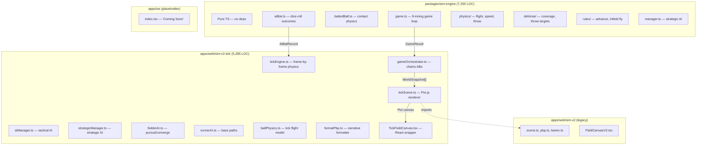

# Sim Architecture Review & Refactor Plan

- May 4th 2026 Review 


## Current Architecture



## Layer Responsibilities

| Layer | What it does | Where it runs | Platform-agnostic? |
|---|---|---|---|
| **sim-engine** | Rolls outcomes: AB results, batted ball physics, game loop | CPU-only | ✅ Yes — pure TS, no DOM |
| **tickEngine** | Converts outcomes → frame-by-frame entity positions | CPU-only | ⚠️ Almost — imports sim-engine types only |
| **gameOrchestrator** | Chains ABs, manages innings, injects AI decisions | CPU-only | ⚠️ Almost — lives in web app |
| **aiManager / strategicManager** | Tactical + strategic AI decisions | CPU-only | ⚠️ Almost — lives in web app |
| **tickScene** | Pixi.js rendering, HUD, camera, z-ordering | Browser-only | ❌ Pixi.js = DOM/WebGL |
| **TickFieldCanvas** | React wrapper, playback controls, PBP | Browser-only | ❌ React DOM |
| **sim-v2 (legacy)** | V1 tween-based renderer | Browser-only | ❌ Dead code (still imported) |

## Critical Issues Found

### 1. 🔴 Scoring is Wildly Inflated
Every test game produces 14-59 runs per team. A real MLB game averages 4-5 runs. This makes games 2-3× longer than they should be, compounds the memory/perf issue, and makes the PBP feed an unreadable wall of text.

**Root cause:** Likely in `atBat.ts` or `battedBall.ts` — hit rates and/or batted ball quality are too generous. This is the #1 gameplay issue.

**Impact:** 140-170 ABs per game → 18K+ snapshots → 40+ MB in memory → 3-5 second sim time.

### 2. 🔴 Platform Coupling — Tick Engine Lives in Web App
The entire tick simulation (`tickEngine.ts`, `gameOrchestrator.ts`, `aiManager.ts`, `strategicManager.ts`, `fielderAI.ts`, `runnerAI.ts`, `ballPhysics.ts`) is inside `apps/web/src/components/`. This is **pure computation with zero DOM dependencies** — it should be in `packages/` so iOS can consume it.

### 3. 🟡 V1 Still Imported
`tickScene.ts` imports from `sim-v2/` for:
- `coords.ts` — coordinate transforms (shared utility)
- `field/drawField.ts` — field rendering
- `scene/sprites.ts` — fielder/runner sprite factories

These are renderer utilities and should stay, but `sim-v2/` also contains dead code (`scene.ts`, `pbp.ts`, `tween.ts`) and the old `sim-lab` page.

### 4. 🟡 Snapshot Memory — Still Heavy
After optimization: ~42 MB for a high-scoring game, ~19 MB for a normal one. Each snapshot carries 9 fielder position objects. Further reduction possible by:
- Delta-encoding positions (store only changes)
- Quantizing floats to fixed-point integers
- Binary format instead of JSON-like objects

### 5. 🟡 No Web Worker
Sim runs on the main thread. The `setTimeout(50)` hack yields to the browser for the loading state, but the 2-5 second sim still freezes the UI. A proper Web Worker would keep 60fps during sim.

### 6. 🟢 PBP Generator is Orphaned
`pbpGenerator.ts` (367 LOC) exists alongside the new `formatPbp.ts` (257 LOC). Only `formatPbp.ts` is used. Dead code.

---

## Proposed Refactor

### Phase 1: Extract `@baseballczar/tick-engine` Package

Move all platform-agnostic tick simulation into a new shared package:

```
packages/
  sim-engine/          ← dice-roll outcomes (existing)
  tick-engine/         ← frame-by-frame physics (NEW)
    src/
      tickEngine.ts
      gameOrchestrator.ts
      aiManager.ts
      strategicManager.ts
      fielderAI.ts
      runnerAI.ts
      ballPhysics.ts
      spatial.ts
      entities.ts
      managerProfiles.ts
      formatPbp.ts
      index.ts
    package.json       ← depends on @baseballczar/sim-engine
```

**Why:** Both web and iOS can import `@baseballczar/tick-engine` for simulation. The renderer (Pixi.js / SpriteKit / SceneKit) is platform-specific, but the simulation data is identical.

### Phase 2: Fix Scoring Balance

Audit `atBat.ts` hit probability tables and `battedBall.ts` exit velocity distributions. Target:
- **Average game:** 60-75 ABs, 3-6 runs per team
- **High-scoring game:** 90 ABs max
- **Snapshots:** 5K-8K per game → ~10-15 MB

This single fix solves perf, memory, and PBP readability all at once.

### Phase 3: Web Worker for Simulation

```
┌─────────────────┐      ┌─────────────────┐
│   Main Thread   │      │   Web Worker     │
│                 │      │                  │
│  React UI       │ msg  │  tick-engine     │
│  Pixi renderer  │◄────►│  sim-engine      │
│  PBP panel      │      │  orchestrator    │
│  Controls       │      │                  │
└─────────────────┘      └─────────────────┘
```

Main thread sends `{ seed, homeProfile, awayProfile }`, worker returns `WorldSnapshot[]`. UI stays at 60fps throughout.

### Phase 4: iOS Integration Strategy

Two viable paths for the iOS app:

#### Option A: Embedded JS Engine (Recommended)
- Use React Native's JSC/Hermes to run `@baseballczar/tick-engine` directly
- SpriteKit or SwiftUI Canvas for rendering (reads `WorldSnapshot[]` from JS)
- Same simulation logic, native-quality visuals

#### Option B: WebView Hybrid
- Embed the Pixi.js canvas in a WKWebView
- Ship the sim as a self-contained HTML bundle
- Lowest effort but non-native feel

#### Option C: Swift Port
- Rewrite tick-engine in Swift
- Maximum performance but maintenance burden of two codebases
- Only justified if JS perf is insufficient on device

> [!TIP]
> **Option A** is the sweet spot. The tick-engine is pure math — it runs fine in Hermes. The renderer is the only iOS-specific piece, and SpriteKit handles top-down 2D baseball perfectly.

### Phase 5: Clean Up Legacy

1. Delete `apps/web/src/components/sim-v2/pbp.ts` (replaced by `formatPbp.ts`)
2. Delete `apps/web/src/components/sim-v2/scene.ts` + `tween.ts` (v1 renderer)
3. Delete `pbpGenerator.ts` from sim-v2-tick (orphaned)
4. Keep `sim-v2/coords.ts`, `field/drawField.ts`, `scene/sprites.ts` — these are shared renderer utils
5. Consider moving renderer utils to a `packages/field-renderer/` package

---

## Priority Order

| Priority | Task | Impact | Effort |
|---|---|---|---|
| **P0** | Fix scoring balance | Fixes perf, memory, PBP, gameplay | Medium |
| **P1** | Extract tick-engine package | Unblocks iOS, cleaner architecture | Low-Medium |
| **P2** | Web Worker | Eliminates UI freeze during sim | Medium |
| **P3** | Clean up legacy v1 code | Reduces confusion, dead code | Low |
| **P4** | iOS renderer (SpriteKit) | Mobile app | High |
| **P5** | Snapshot compression | Further memory reduction | Medium |

> [!IMPORTANT]
> **P0 (scoring balance) is the single highest-impact change.** It would cut sim time by 50-60%, reduce memory by 50-60%, make PBP readable, and make games feel realistic — all from tuning a few probability tables in `atBat.ts`.
