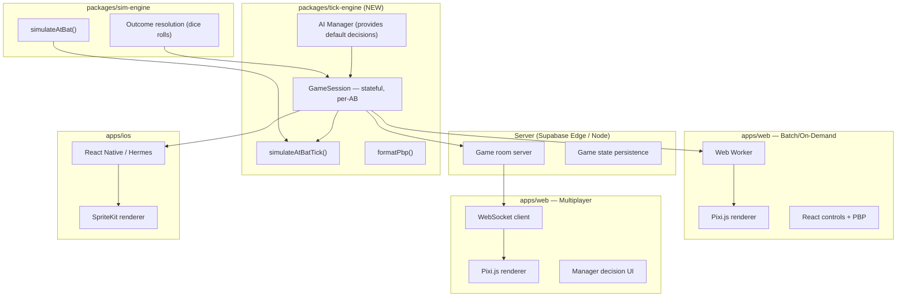

# Sim Refactor — Updated for Multiplayer

> Updated May 4, 2026 — incorporates on-demand sim + 1v1 Manager vs Manager

## Three Execution Modes

The sim needs to support **three distinct modes** through a single architecture:

### Mode 1: Batch Playback (current)
Pre-rolled season games replayed visually. No human input.
```
sim-engine.simulateGame() → full GameResult
  → orchestrator → all snapshots at once
  → client plays back from snapshot array
```

### Mode 2: On-Demand Sim
User picks two teams, sim runs immediately. Still AI-driven, but generated on the fly.
```
Same as Mode 1, but triggered by user action
  → could run in Web Worker or server-side
```

### Mode 3: Multiplayer 1v1 (Manager vs Manager)
Two human players make strategic decisions. The sim pauses at decision points.
```
For each AB:
  1. Server presents game state to both managers
  2. Each manager submits decisions (pitch call, defensive shift, etc.)
  3. sim-engine resolves the AB with those inputs
  4. tick-engine generates snapshots for that AB only
  5. Client(s) play back that AB's snapshots
  6. Repeat until game over
```

## Why This Changes Everything

The current `gameOrchestrator.simulateFullGame()` is a **synchronous, batch function**:

```ts
// Current: runs ALL at-bats in one call, returns everything
function simulateFullGame(result: GameResult, ...): FullGameResult {
  for (const ab of result.atBats) {   // all pre-rolled
    const snaps = simulateAtBatTick(ab, ...);
    allSnapshots.push(...snaps);
  }
  return { snapshots: allSnapshots };  // 18K+ snapshots, 40+ MB
}
```

For multiplayer, we need an **incremental, stateful model**:

```ts
// Needed: processes one AB at a time, holds game state between calls
class GameSession {
  state: GameState;         // inning, score, outs, runners, lineup position
  
  // Returns decision points for both managers
  getDecisionContext(): ManagerDecisionContext;
  
  // Accept decisions and simulate the next AB
  advanceAB(decisions: ManagerDecisions): ABResult & { snapshots: WorldSnapshot[] };
  
  // Check if game is over
  isComplete(): boolean;
}
```

## Revised Architecture



## GameSession Design

The core abstraction that enables all three modes:

```ts
interface ManagerDecisions {
  /** Defensive alignment overrides (optional). */
  defensiveShift?: Partial<Record<Position, Point2D>>;
  /** Pitch call (optional — AI fills in if absent). */
  pitchCall?: PitchCall;
  /** Strategic calls: pinch-hit, pinch-run, pitching change. */
  strategic?: StrategicAction[];
  /** Signal to runners: steal, hit-and-run. */
  runnerSignal?: RunnerSignal;
}

interface ABResult {
  record: AtBatRecord;          // what happened
  snapshots: WorldSnapshot[];   // visual frames for this AB only
  pbp: PbpEntry[];              // narrative entries
  newState: GameState;          // updated game state after AB
}

class GameSession {
  constructor(home: Team, away: Team, rng: Rng, options?: SessionOptions);
  
  /** Current game state (inning, score, outs, runners, etc). */
  getState(): GameState;
  
  /** Context for managers to make decisions. */
  getDecisionContext(): {
    batter: Player;
    pitcher: Player;
    situation: GameSituation;
    suggestedAI: ManagerDecisions;  // what AI would do
  };
  
  /** Advance one at-bat with the given decisions. */
  advance(
    homeDecisions?: ManagerDecisions,
    awayDecisions?: ManagerDecisions,
  ): ABResult;
  
  /** Is the game over? */
  isComplete(): boolean;
  
  /** Final result (once complete). */
  getResult(): GameResult;
}
```

### How Each Mode Uses GameSession

**Batch Playback:**
```ts
const session = new GameSession(home, away, rng);
const allSnapshots: WorldSnapshot[] = [];
while (!session.isComplete()) {
  const result = session.advance();  // AI decides everything
  allSnapshots.push(...result.snapshots);
}
// Hand allSnapshots to renderer
```

**On-Demand (identical, but in a Web Worker):**
```ts
// worker.ts
self.onmessage = ({ data: { home, away, seed } }) => {
  const session = new GameSession(home, away, createRng(seed));
  while (!session.isComplete()) {
    const result = session.advance();
    self.postMessage({ type: 'ab-complete', ...result });  // stream per-AB
  }
  self.postMessage({ type: 'game-complete' });
};
```

**Multiplayer 1v1:**
```ts
// server — game room
const session = new GameSession(home, away, rng);

while (!session.isComplete()) {
  const ctx = session.getDecisionContext();
  
  // Send context to both players via WebSocket
  sendToPlayer(homeSocket, { type: 'your-turn', ...ctx });
  sendToPlayer(awaySocket, { type: 'your-turn', ...ctx });
  
  // Wait for both to submit decisions (with timeout → AI fallback)
  const [homeDec, awayDec] = await Promise.all([
    waitForDecision(homeSocket, 30_000),
    waitForDecision(awaySocket, 30_000),
  ]);
  
  const result = session.advance(homeDec, awayDec);
  
  // Stream snapshots to both clients
  broadcast({ type: 'ab-result', ...result });
}
```

## What Changes in the Refactor

### Original Plan → Updated Plan

| Phase | Original | Updated | Why |
|---|---|---|---|
| **P0** | Fix scoring | Fix scoring | Same — still P0 |
| **P1** | Extract tick-engine | Design `GameSession` API first, THEN extract | Can't extract without the right API surface |
| **P1.5** | — | **Refactor orchestrator → GameSession** | This is the core change |
| **P2** | Web Worker | Web Worker with **streaming** (per-AB messages) | Don't send 40MB at once — stream ABs |
| **P3** | Legacy cleanup | Same | Same |
| **P4** | iOS renderer | Same (SpriteKit reads `WorldSnapshot[]`) | GameSession runs in Hermes, renderer native |
| **P5** | — | **Multiplayer server** (Supabase Edge Functions or Node) | New phase |

### Key Design Decisions

1. **GameSession holds game state** — not the orchestrator function
2. **Per-AB streaming** — renderer gets snapshots one AB at a time, not all at once
3. **Decisions are optional** — AI fills in anything the human doesn't specify
4. **Deterministic replay** — same `rng` seed + same decisions = same game (enables replay saving)
5. **Server-authoritative for multiplayer** — GameSession runs on server, clients only render

### What Stays the Same

- `sim-engine` package (outcome resolution) — untouched
- `tickEngine.simulateAtBatTick()` — already per-AB, no changes
- Pixi.js renderer (`tickScene.ts`) — already consumes `WorldSnapshot[]`
- `formatPbp.ts` — already event-driven

### What's New

- `GameSession` class — replaces `simulateFullGame()`
- Streaming renderer support — `tickScene` accepts snapshots incrementally
- Decision UI for multiplayer — pitch call selector, shift toggle, etc.
- Game room server — WebSocket matchmaking + state relay

## iOS Implications

With Option A (embedded JS engine):

```
iOS App
├── @baseballczar/sim-engine   ← runs in Hermes
├── @baseballczar/tick-engine  ← runs in Hermes (GameSession)
├── SpriteKit renderer         ← native Swift
│   └── Reads WorldSnapshot[] from JS bridge
└── SwiftUI                    ← manager decision UI
```

The `GameSession` API is the same whether called from a Web Worker, a Node server, or Hermes on iOS. The renderer is the only platform-specific piece.

## Answer to Your Questions

**Can it support 1v1 Manager vs Manager?**
Yes — the `GameSession` abstraction is specifically designed for this. It pauses between ABs to accept human decisions, with AI fallback for timeouts. The server runs the session, both clients render + decide.

**Does on-demand + multiplayer change the refactor approach?**
Yes, significantly:
- The orchestrator needs to become **stateful + incremental** (GameSession) instead of a batch function
- The renderer needs to accept snapshots **per-AB** instead of all-at-once
- The Web Worker should **stream** results instead of returning one massive array
- We need to design the `ManagerDecisions` interface before extracting the package

> [!IMPORTANT]
> **The refactor order matters.** Design GameSession API → Fix scoring → Extract package → Web Worker with streaming → iOS → Multiplayer server. Getting the API right first prevents having to re-extract later.
